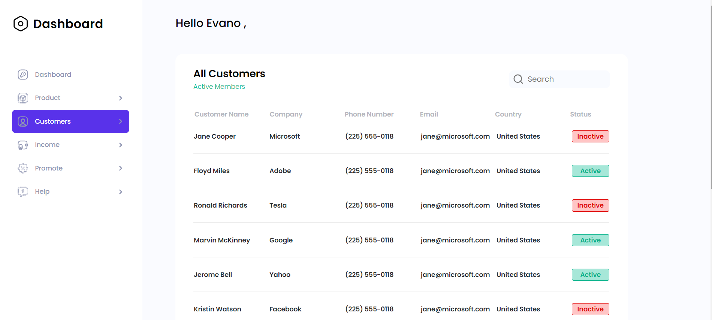
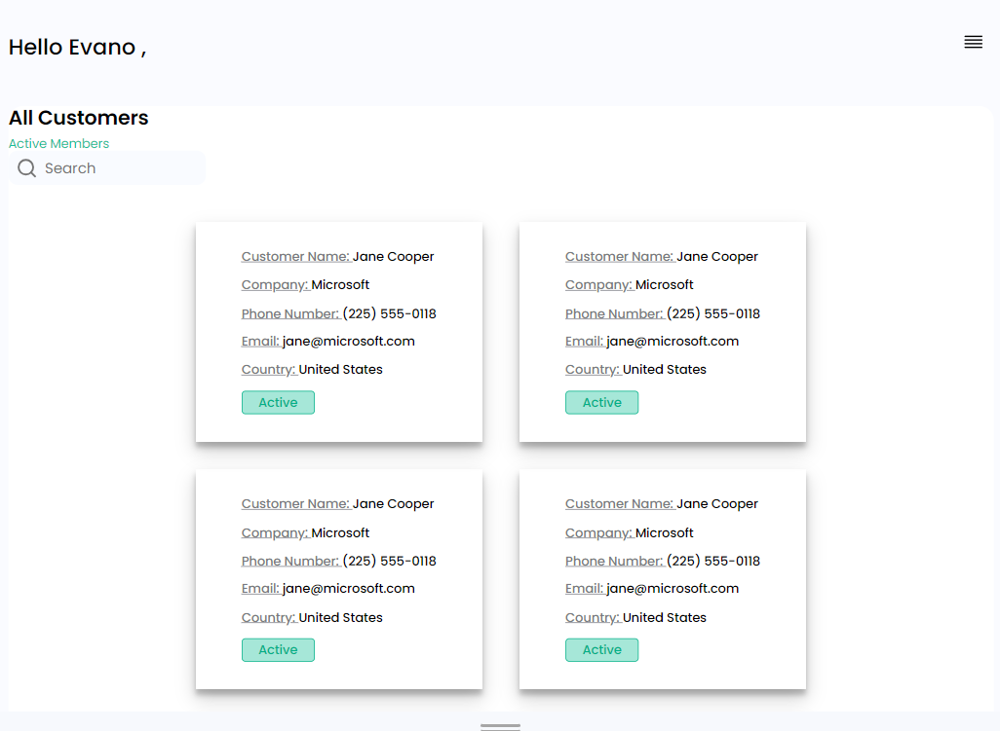
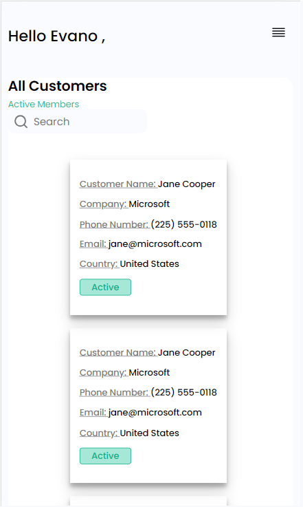

Gorbacheva-test. test task for the company. During development, the following
technologies were used: HTML, CSS, JavaScript

Libraries:modern-normalize, paginationjs

One page of CRM system with table of clients data, wich you can falter by name
using search input.

Pagination: pagination was made using paginationjs. Every page contain 8
elements

Implemented mobile, tablet and desktop version of interface.

  
